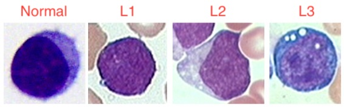

# Detecting Acute Lymphoblastic Leukemia (ALL) with a Convolutional Neural Network

Aren Carpenter 
DS Cohort 062220
September 2020

## Introduction

Acute Lymphoblastic Leukemia (ALL) is the most common pediatric cancer and the most frequent cause of death from cancer before 20 years of age. In the 1960s ALL had a survival rate of only 10%, but advancements in diagnostic testing and refinements to chemotherapies have have increased survival rates to 90% (in developed countries, that is). ([1](https://www.nejm.org/doi/full/10.1056/NEJMra1400972)) Researchers are attempting a variety of personalized approaches, mainly using epigenetic screenings and genome-wide association studies (GWAS) to identify potential targets for inhibition, to push survival rates even higher. ([2](https://www.ncbi.nlm.nih.gov/pmc/articles/PMC4567699/), [3](https://www.nature.com/articles/bcj201753)) About 80% of ALL cases are children, but, as Terwilliger and Abdul-Hay note, there is another peak of ALL incidence at 50 years of age and long-term remission rates in the older subset of patients is lower than children, about 30-40%. ([3](https://www.nature.com/articles/bcj201753))

ALL is described as the proliferation and differentiation of lymphoid cells in the bone marrow. Important cellular processes, such as the regulation of lymphoid differentiation, cell cycle regulation, growth factor and tumor-suppressor receptor signaling, and epigenetic modification, are perturbed. Additionally, chromosomal translocations are present in about a third of ALL cases. This can cause the overexpression of  oncogenes by relocating them to actively transcribed regions or underexpression of tumor-suppressing genes by relocating them to non-transcribed regions of the genome. ([1](https://www.nejm.org/doi/full/10.1056/NEJMra1400972), [3](https://www.nature.com/articles/bcj201753)) ALL is commonly polyclonal which further complicates treatment because a number of sub-populations will likely be resistent to any one treatment. ([1](https://www.nejm.org/doi/full/10.1056/NEJMra1400972))

### ALL Cell Morphology

ALL can be split into 3 distinct subtypes that makes identification difficult, even for experienced practitioners. L1 are small and homogeneous, round with no clefting, and with no obvious nucleoli or vacuoles. These are the most likely to pass as normal lymphoblasts. L2 are larger and heterogeneous, irregular shape and often clefted, and have defined nucleoli and vacuoles. L3 have the shape of L1 but have prominent nucleoli and vacuoles. ([4](https://www.ncbi.nlm.nih.gov/pmc/articles/PMC4335145/), [5](http://piurilabs.di.unimi.it/Papers/cimsa_2005.pdf))

Here are some normal cells from our set:

  
   
  
  

Here are some ALL cells from our set:

  
   
  
  

Looking at the average image for each class we see that the interior of the cells have too much variation to identify meaningful differences, but we see clearly that ALL cells are much larger on average than normal cells. This should not be surprising as cancerous cells have unregulated growth. 

  
   

## Data Collection

The data consists of 10,000+ images of single-cell microscopy acute lymphoblastic leukemia and normal lymphoblasts with a class imbalance of about 2:1 ALL to normal. Having enough images and computing resources without using all images, I decided to downsample the positive ALL class to manage class imbalance. 

Images are 450x450 RGB images stored as .bmp files, a raster graphics bitmap which stores images as 2D matrices.

Data can be found [here](https://wiki.cancerimagingarchive.net/display/Public/C_NMC_2019+Dataset%3A+ALL+Challenge+dataset+of+ISBI+2019#4dc5f53338634b35a3500cbed18472e0).

## Modeling

I utilized the Keras framework in AWS Sagemaker by specifying neural network architecture and compilation hyperparameters in a separate python script. Training was accomplished in a ml.m4.xlarge notebook instance allowing for hundreds of epochs in a tractable training time. 

I adopted an iterative approach to modeling based on the CRISP-DM process. Starting with a baseline CNN with a single Conv2D layer, additional layers and blocks of layers (3 blocks of 3 Conv2D layers with MaxPooling layers between) were added to select from maximum validation and testing accuracy. 

My final network architecture is described below in text and visualization. 

