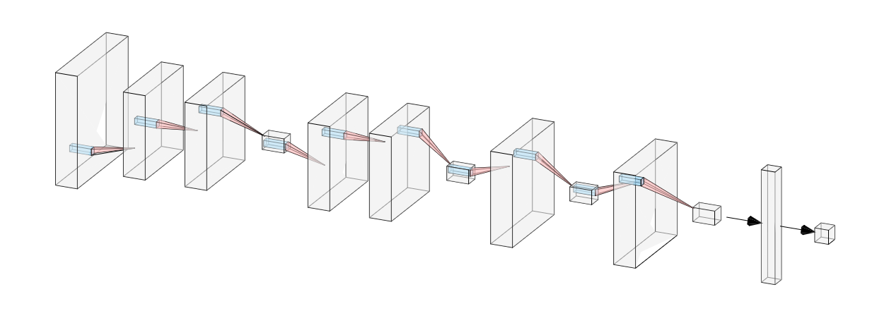

# Detecting Acute Lymphoblastic Leukemia (ALL) with a Convolutional Neural Network

**Aren Carpenter** 

DS Cohort 062220

## Introduction

Acute Lymphoblastic Leukemia (ALL) is the most common pediatric cancer and the most frequent cause of death from cancer before 20 years of age. In the 1960s ALL had a survival rate of only 10%, but advancements in diagnostic testing and refinements to chemotherapies have have increased survival rates to 90% in developed countries. ([1](https://www.nejm.org/doi/full/10.1056/NEJMra1400972)) Researchers are attempting a variety of personalized approaches, mainly using epigenetic screenings and genome-wide association studies (GWAS) to identify potential targets for inhibition, to push survival rates even higher. ([2](https://www.ncbi.nlm.nih.gov/pmc/articles/PMC4567699/), [3](https://www.nature.com/articles/bcj201753)) About 80% of ALL cases are children, but, as Terwilliger and Abdul-Hay note, there is another peak of ALL incidence at 50 years of age and long-term remission rates in the older subset of patients is lower than children, about 30-40%. ([3](https://www.nature.com/articles/bcj201753))

ALL is described as the proliferation and differentiation of lymphoid cells in the bone marrow. Important cellular processes, such as the regulation of lymphoid differentiation, cell cycle regulation, growth factor and tumor-suppressor receptor signaling, and epigenetic modification, are perturbed. Additionally, chromosomal translocations are present in about a third of ALL cases. This can cause the overexpression of  oncogenes by relocating them to actively transcribed regions or underexpression of tumor-suppressing genes by relocating them to non-transcribed regions of the genome. ([1](https://www.nejm.org/doi/full/10.1056/NEJMra1400972), [3](https://www.nature.com/articles/bcj201753)) ALL is commonly polyclonal which further complicates treatment because a number of sub-populations will likely be resistent to any one treatment. ([1](https://www.nejm.org/doi/full/10.1056/NEJMra1400972))

### Repository Navigation

- **[001_Load_and_Clean_Images.ipynb](001_Load_and_Clean_Images.ipynb)**: From downloading images, split into folder hierarchy of normal and all subdirectories in train/test/validation superdirectories.
- **002_Exploratory_Data_Analysis.ipynb**: Creating visualizations of representative images, mean images, and class imbalance, in addition to model visuals.
- **003_Modeling_AWS.ipynb**: Script for utilizing AWS SageMaker training instances and accessing AWS S3 buckets for storing images.
- **004_Modeling_Local.ipynb**: CPU-based local modeling with Keras framework
- **Model_Scripts**: Directory for defining Keras model architectures as python scripts to be called in the 003_Modeling_AWS.ipynb. 

One should run 001_Load_and_Clean_Images and 002_EDA in a local notebook to create directories locally for use in EDA, but one must use AWS Sagemaker for the 003_Modeling_AWS file to work. Individual models are run by calling a script from the Modeling_Scripts folder in Sagemaker. Local models can be run via the Keras framework using 004_Modeling_Local. 

The slide deck for this project can be found [here](https://docs.google.com/presentation/d/1Ghsj7xBMBZUB8QsEuey53VU2La74BctSShgnL4ZN4eo/edit?usp=sharing).

### ALL Cell Morphology

ALL can be split into 3 distinct subtypes that makes identification difficult, even for experienced practitioners. L1 are small and homogeneous, round with no clefting, and with no obvious nucleoli or vacuoles. These are the most likely to pass as normal lymphoblasts. L2 are larger and heterogeneous, irregular shape and often clefted, and have defined nucleoli and vacuoles. L3 have the shape of L1 but have prominent nucleoli and vacuoles. ([4](https://www.ncbi.nlm.nih.gov/pmc/articles/PMC4335145/), [5](http://piurilabs.di.unimi.it/Papers/cimsa_2005.pdf))

## Data Collection

The data consists of 10,000+ images of single-cell microscopy acute lymphoblastic leukemia and normal lymphoblasts with a class imbalance of about 2:1 ALL to normal. Having enough images and computing resources without using all images, I decided to downsample the positive ALL class to manage class imbalance. Thus, training was completed with 4,000 images with a 57:43 class imbalance. 

Images are 450x450 RGB images stored as .bmp files, a raster graphics bitmap which stores images as 2D matrices.

Data can be found [here](https://app.box.com/s/xeclwwd2xep9ntljtgyptmt4k5wone9n). It was sourced from the University of Arkansas for Medical Sciences (UAMS) study on ALL microscopy. 

## Exploratory Data Analysis

Here are some normal cells from our set. We see spherical, non-clefted cells with homogeneous chromatin and few vacuoles. 

  
   
  
  

Here are some ALL cells from our set. We see irregularly shaped, clefted cells with heterogeneous chromatin and multiple nucleoli and vacuoles. 

  
   
  
  

### Average Images

Looking at the average image for each class we see that the interior of the cells have too much variation to identify meaningful differences, but we see clearly that ALL cells are much larger on average than normal cells. This should not be surprising as cancerous cells have unregulated growth. 

  
   

## Modeling

> *I used this [post](https://blog.betomorrow.com/keras-in-the-cloud-with-amazon-sagemaker-67cf11fb536) from Paul Breton and the corresponding GitHub [repo](https://github.com/Pravez/KerasSageMaker) for guidance on utilizing Keras with Sagemaker.*  

I utilized the Keras framework in AWS Sagemaker by specifying neural network architecture and compilation hyperparameters in a separate Python script located in the Model_Scripts directory. Training was accomplished in a ml.m4.xlarge notebook instance allowing for hundreds of epochs in a tractable training time. 

I adopted an iterative approach to modeling based on the CRISP-DM process. A dummy classifier predicting the majority class had an accuracy of 57%. I created a Vanilla model with a single Conv2D layer and a single Dense layer which had an accuracy of 68%, already better than the dummy. I then created successively larger and more complex architectures by adding additional Conv2D layers and blocks of layers separated by MaxPooling layers. 

The most complex had 9 convolutions in 3 blocks of 3 layers, but this was not the most successful model as it appeared to overfit our training data. It became clear that deep, but narrow blocks were achieving higher metrics than wider blocks. The best model was a 2x2x1x1 architecture with 6 total convolutions. Dropout layers and Batch Normalization were added after MaxPooling and Dense layers to combat overfitting, but were not present in the final model. 

I attempted to use recall as a secondary metric for model selection, however this pushed the model to always selecting ALL for images and pushed the model accuracy down to the dummy classifier. I thus decided to drop recall and focus on accuracy. With recall so high and accuracy sacrificed the model would be useless as a tool because all images would have to be reviewed by a human physician anyway, negating the benefits of the model.

#### Final Network Architecture

#### Model Compilation Hyperparameters

I used binary crossentropy for the loss function as this is a binary classification problem, and RMSprop and Adam for optimization. The learning rate was set to 0.001 with a decay of 0.0001. 

#### Model Evaluation

A selection of my iterative modeling process with accuracy and loss metrics. 

Model | Accuracy | Loss
------------ | ------------- | ------------
Dummy | 0.57 | 
Vanilla | 0.6875 | 2.39
2x2x1x1C1D | 0.84375 | 1.3986
2x1x1C1D with Dropout | 0.84 | 1.5263
2x2x1C1D with Dropout | 0.8125 | 1.9057
3x3C1D with Dropout | 0.6875 | 3.6557
3x2C2D with Dropout | 0.625 | 5.3753
4x1C1D | 0.68775 | 3.69

#### Model Deployment

The best performing model was deployed using AWS Endpoints in order to load in not-yet-seen images from the testing set in order to generate predictions. The deployment is located in the 003_Modeling_AWS notebook under model training.

#### Misclassified Images

Here we see an image the model misclassified as Normal when it was actually ALL. The model is apparently responding to the lack of interior vacuoles and clefting as well as a dense chromatin to classify as normal. The irregular shape should have shown that it was ALL. 

  

Here we see an image the model misclassified as ALL when it was actually Normal. The model is likely responding to the irregular cell outline as well as the lighter areas in the interior that suggest vacuoles to classify it as ALL. This is definitely a challenging cell to correctly sort.

  

## Insights and Recommendations

The model achieved an accuracy of 84%, allowing it to be a useful tool for identifying ALL in novel cases. As blood sample microscopy is already the default diagnostic test for ALL, this model could easily be used to verify a human physician or to flag cases that the model is not confident in for further review. As diagnosing ALL is difficult even for humans, having a robust, accurate verification model could improve the speed and rigor of diagnosis. Due to ALL being an acute leukemia, it is especially vital that it is consistently identified early, left untreated it can kill within a few weeks or months. 

## Next Steps

### Model Improvements

There are several potential avenues for improvement for this model. I attempted to use the Adam optimizer, which adds a sense of momentum and bias-correction to the gradient calculated by RMSprop, and Batch Normalization to improve model performance, though it did help modeling thus far. I could also implement Early Stopping and Model Checkpoints to combat overfitting by allowing the model to stop training once a threshold of overfitting has been reached. I experimented with several levels of Dropout, settling on 25%, but further investigation could yield better results. 

### Product Improvements

Model interpretability is often as or more important than model accuracy, especially for medical diagnostic needs. It is very important in real-world applications that a doctor can see why the model has reached a certain decision. To that end, building an image segmentation model that identifies and marks important features, such as presence and number of vaculoes, non-spherical cells, or clefted edges within an image could greatly improve the model's usability. Additionally, deploying the model and allowing for live-integration of new imaging would keep the model up-to-date. 